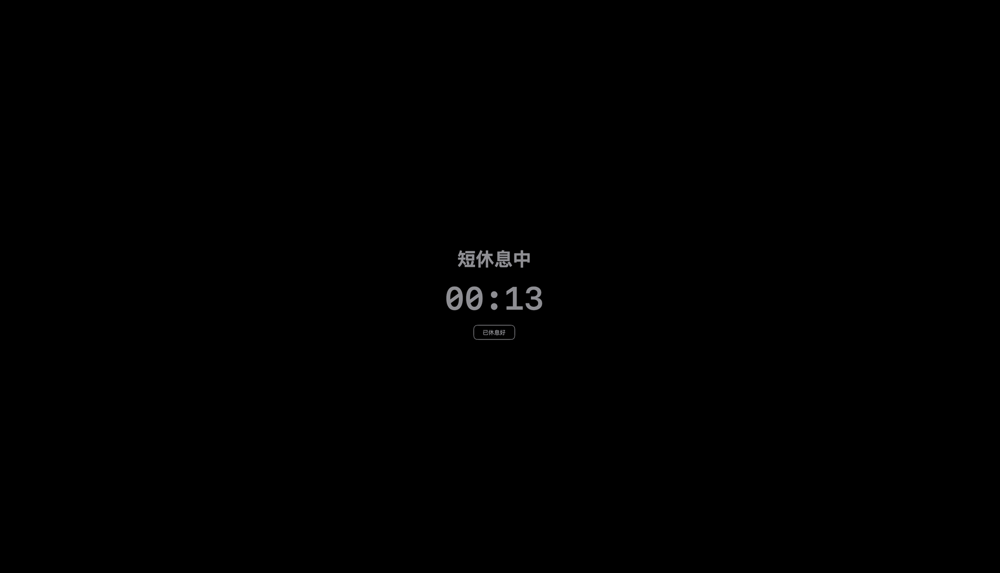
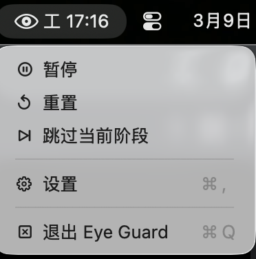
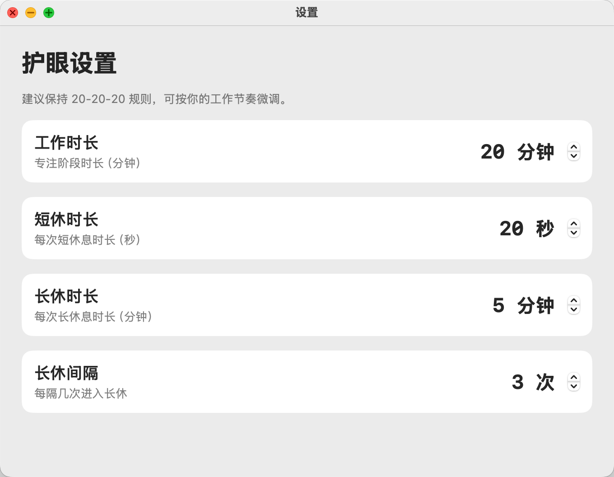

# Mac Eye Guard

一个 macOS 护眼app。别名：眼睛护士/眼睛卫视/护眼计时程序

默认规则：
- 工作 20 分钟
- 休息 20 秒
- 每隔 3 次休息进入 5 分钟长休

休息期间会在所有屏幕显示黑色遮罩，展示倒计时和 `已休息好` 按钮。

1. 休息界面：

2. 菜单栏界面：

3. 设置界面：

## 启动
下载：MacEyeGuard.zip   解压缩后，直接双击打开即可。

## 可配置项
在菜单栏中打开 `设置`：
- 工作时长（分钟）
- 短休时长（秒）
- 长休时长（分钟）
- 每隔几次进入长休

## English Introduction

A small macOS eye-care app. Also known as: Eye Nurse / Eye Guard / Eye Care Timer.

Default rules:
- Work 20 minutes
- Rest 20 seconds
- Every 3 short breaks, take a 5-minute long break

During the rest period, a black mask is shown on all screens, displaying a countdown and a `Rested` button.

1. Break screen:

2. Menu bar:

3. Settings screen:

## Launch
Download: `MacEyeGuard.zip`. Unzip it and double-click to open.

## Configurable Options
Open `Settings` from the menu bar:
- Work duration (minutes)
- Short break duration (seconds)
- Long break duration (minutes)
- Number of short breaks before a long break
